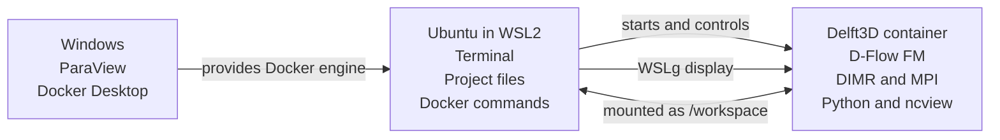

# Delft3D-FM on Windows

This project provides a ready-to-use Linux environment for running
[Delft3D Flexible Mesh](https://www.deltares.nl/en/software-and-data/products/delft3d-fm-suite)
on a Windows engineering workstation.

It is written for Delft3D users—not for computer-science specialists. The guide
starts with a new Windows computer and covers installation, model execution,
data storage, quick inspection, and visualization in ParaView.

## What this system contains

The software is divided across three layers:



- **Windows** runs Docker Desktop and the separately installed ParaView
  application.
- **Ubuntu in WSL2** provides the Linux terminal from which you build, start,
  and control the container. WSLg allows `ncview` windows from the container to
  appear on the Windows desktop.
- **The container** contains D-Flow FM, DIMR, Intel MPI, NetCDF tools, Python
  scientific packages, and `ncview`.
- **`/workspace`** is the shared data location. A directory from Ubuntu or
  Windows is mounted there so input and output files survive container removal.

ParaView is not installed in the container. It runs directly on Windows and
opens the NetCDF results written to the shared workspace.

## Where should I start?

- **Setting up a new workstation:** begin with [Part 1](#part-1-set-up-windows).
- **The workstation is already configured:** go to
  [Part 3](#part-3-start-and-stop-the-container).
- **Adding model files:** read [Part 4](#part-4-understand-workspace).
- **Running and inspecting models:** use [Part 5](#part-5-use-the-tools).
- **Opening results in ParaView:** use
  [Part 6](#part-6-visualize-results-in-windows-paraview).
- **Returning for normal daily work:** use
  [Part 7](#part-7-routine-workflow).
- **Something is not working:** go to [Troubleshooting](#troubleshooting).

## Before you begin

You need:

- A supported 64-bit Windows 10 or Windows 11 installation
- Hardware virtualization enabled in the computer's BIOS or UEFI
- At least 8 GB RAM; 16 GB or more is strongly recommended for model work
- Substantial free disk space; allow at least 50 GB for the image, build cache,
  repository, and initial model data
- Permission to install WSL and Docker Desktop
- An internet connection for initial installation and image construction

Docker Desktop is free for education and personal use, subject to Docker's
current license terms.

> **Terminal labels used below**
>
> - **Windows PowerShell (Administrator)** means PowerShell opened with
>   **Run as administrator**.
> - **Ubuntu terminal** means the Ubuntu application installed through WSL.
> - **Container shell** means the prompt displayed after running
>   `docker exec -it delft3d bash`.
>
> Run each command in the terminal identified by its section. Windows,
> Ubuntu, and the container are different environments.

---

## Part 1: Set up Windows

These steps are normally completed once on each workstation.

### 1. Install WSL2 and Ubuntu

Open **Windows PowerShell as Administrator** and run:

```powershell
wsl --install -d Ubuntu
```

Restart Windows if requested. Open **Ubuntu** from the Windows Start menu.
During its first launch, Ubuntu asks you to create:

- A Linux username
- A Linux password

The password is separate from your Windows password. Nothing appears on screen
while you type it; this is normal Linux behavior.

Return to **Windows PowerShell** and verify that Ubuntu is using WSL version 2:

```powershell
wsl --version
wsl --list --verbose
```

The `VERSION` column beside Ubuntu must be `2`. If it is `1`, run:

```powershell
wsl --set-version Ubuntu 2
```

Update WSL to obtain the latest WSLg GUI support:

```powershell
wsl --update
wsl --shutdown
```

Reopen the **Ubuntu terminal** and check its GUI display:

```bash
echo "$DISPLAY"
```

A value such as `:0` confirms that WSLg supplied a display. An empty result
should be corrected before testing `ncview`.

Official reference:
[Install WSL](https://learn.microsoft.com/windows/wsl/install) and
[run Linux GUI applications with WSL](https://learn.microsoft.com/windows/wsl/tutorials/gui-apps).

### 2. Install Docker Desktop and enable Ubuntu integration

Download and install
[Docker Desktop for Windows](https://docs.docker.com/desktop/setup/install/windows-install/).
Select the **WSL 2** backend when the installer offers that choice, then start
Docker Desktop.

In Docker Desktop:

1. Open **Settings → General**.
2. Enable **Use the WSL 2 based engine**, if the option is visible.
3. Open **Settings → Resources → WSL Integration**.
4. Enable integration for **Ubuntu**.
5. Select **Apply & restart**.
6. Ensure Docker Desktop is using **Linux containers**.

> **Do not install a separate Docker Engine inside Ubuntu.**
>
> Docker Desktop's WSL integration places the usable Docker command-line tools
> in the Ubuntu environment and connects them to Docker Desktop's Linux engine.
> Installing another engine or CLI with `apt` can create conflicts.

With Docker Desktop running, open the **Ubuntu terminal** and verify both
commands:

```bash
docker version
docker compose version
```

`docker version` should show both a **Client** and a **Server** section. If it
shows only the client or reports that it cannot reach the daemon, check that
Docker Desktop is running and Ubuntu integration is enabled.

Official reference:
[Docker Desktop WSL2 backend](https://docs.docker.com/desktop/features/wsl/).

### 3. Install ParaView on Windows

Download the current stable 64-bit Windows release from the official
[ParaView download page](https://www.paraview.org/download/).

Use **ParaView 5.12 or later** because these versions contain the dedicated
NetCDF UGRID reader needed for Delft3D-FM unstructured-mesh output. Install or
extract ParaView according to the selected Windows package, then launch it once
and check **Help → About ParaView**.

ParaView remains a Windows application. Do not install it inside the Delft3D
container.

---

## Part 2: Obtain and build the project

### 4. Install Git in Ubuntu

In the **Ubuntu terminal**:

```bash
sudo apt update
sudo apt install -y git
```

### 5. Download this repository

In the **Ubuntu terminal**:

```bash
mkdir -p ~/Code
cd ~/Code
git clone https://github.com/mwatts93093/delft-container.git
cd delft-container/docker
```

If the department distributes the project as a ZIP archive or through another
repository, extract or clone it into the Ubuntu filesystem and then enter its
`docker` directory.

Keeping the repository under the Ubuntu home directory, such as `~/Code`, is
recommended for Linux and Docker filesystem performance.

### 6. Build the image

Ensure Docker Desktop is running. From the project's `docker` directory in the
**Ubuntu terminal**, run:

```bash
docker build -t delft3dfm:demo .
```

The first build compiles Delft3D-FM and its dependencies from source. It can
take roughly 45–90 minutes depending on processor speed, memory, network
connection, and Docker resource limits. Keep Docker Desktop running and do not
close the Ubuntu terminal during the build.

Confirm the resulting image:

```bash
docker image ls delft3dfm:demo
```

Later builds can reuse Docker's cache and are normally much faster.

### 7. Run the automated acceptance test

Still in the `docker` directory:

```bash
./verify.sh
```

The test checks installed tools and libraries, runs a shortened copy of the
included f34 model, and validates the newly generated UGRID NetCDF output.

Also verify the WSLg path used by `ncview`:

```bash
./verify.sh --gui
```

A fully working system reports:

```text
Functional verification passed (6 checks, mode=smoke, gui=true).
```

---

## Part 3: Start and stop the container

Use either Docker Compose or the manual `docker run` command. Compose is
recommended for routine use because it records the image name, workspace mount,
display forwarding, and container name in one file.

### Option A: Docker Compose—recommended

From the project's `docker` directory in the **Ubuntu terminal**:

```bash
docker compose up -d
```

Check its status:

```bash
docker compose ps
```

Open an interactive shell:

```bash
docker exec -it delft3d bash
```

The prompt is now inside the container. `/workspace` is the shared directory.

Leave the shell without stopping the container:

```bash
exit
```

View container messages:

```bash
docker compose logs
```

Stop and remove the container when finished:

```bash
docker compose down
```

Removing the container does not remove files stored in the mounted workspace
and does not remove the built image.

### Option B: Manual interactive launch

First stop the Compose container if it is running:

```bash
docker compose down
```

Then, from the `docker` directory in the **Ubuntu terminal**:

```bash
docker run --rm -it \
  --name delft3d-manual \
  -e DISPLAY="$DISPLAY" \
  -v /tmp/.X11-unix:/tmp/.X11-unix \
  -v "$(pwd)/workspace:/workspace" \
  delft3dfm:demo \
  bash
```

This command:

- Starts the `delft3dfm:demo` image
- Passes the WSLg display into the container
- Mounts the local `workspace` directory at `/workspace`
- Opens an interactive container shell
- Removes the temporary container after you type `exit`

Files under `/workspace` remain because they are stored outside the container.

### Option C: Manual background launch

For behavior similar to Compose:

```bash
docker run -d \
  --name delft3d-manual \
  -e DISPLAY="$DISPLAY" \
  -v /tmp/.X11-unix:/tmp/.X11-unix \
  -v "$(pwd)/workspace:/workspace" \
  delft3dfm:demo \
  sleep infinity
```

Open a shell:

```bash
docker exec -it delft3d-manual bash
```

Stop and remove it:

```bash
docker stop delft3d-manual
docker rm delft3d-manual
```

---

## Part 4: Understand `/workspace`

Containers are disposable. A file created only inside an unmounted container
can disappear when that container is removed. The `/workspace` mount prevents
that problem.

The supplied Compose file contains:

```yaml
volumes:
  - ./workspace:/workspace
```

This produces the following mapping:

| Location | Path |
|---|---|
| Ubuntu host | `<repository>/docker/workspace` |
| Delft3D container | `/workspace` |
| Windows Explorer | `\\wsl.localhost\<distribution>\home\<user>\...` |

For example, this Ubuntu file:

```text
~/Code/delft-container/docker/workspace/projects/channel/model.mdu
```

appears inside the container as:

```text
/workspace/projects/channel/model.mdu
```

### Recommended project layout

From the `docker` directory in the **Ubuntu terminal**:

```bash
mkdir -p workspace/projects
```

Place each model in its own directory:

```text
workspace/
├── examples/
└── projects/
    ├── channel-study/
    │   ├── model.mdu
    │   ├── model_net.nc
    │   └── boundary-data/
    └── watershed-study/
```

After starting the container:

```bash
docker exec -it delft3d bash
cd /workspace/projects/channel-study
ls
```

### Open the workspace in Windows Explorer

From the `docker` directory in the **Ubuntu terminal**:

```bash
explorer.exe "$(wslpath -w ./workspace)"
```

Windows applications can open files through this Explorer location. For very
large models, computation is generally faster when files remain in the Ubuntu
filesystem rather than under `/mnt/c`.

### Mount a Windows directory instead

Some users prefer to keep models directly in Windows Documents. Create a
Windows directory such as:

```text
C:\Users\YourName\Documents\Delft3D
```

In WSL, the same directory is:

```text
/mnt/c/Users/YourName/Documents/Delft3D
```

Edit `docker-compose.yml` in the project's `docker` directory and replace:

```yaml
- ./workspace:/workspace
```

with:

```yaml
- "/mnt/c/Users/YourName/Documents/Delft3D:/workspace"
```

Replace `YourName` with the actual Windows username. Keep the quotation marks
if the path contains spaces. Recreate the container:

```bash
docker compose down
docker compose up -d
```

The Windows folder is now `/workspace` inside the container.

The equivalent manual mount is:

```bash
-v "/mnt/c/Users/YourName/Documents/Delft3D:/workspace"
```

---

## Part 5: Use the tools

Start the container and enter it:

```bash
docker compose up -d
docker exec -it delft3d bash
```

The commands below run in the **container shell**.

### Show installed versions

```bash
delft3d-info
dflowfm --version
mpirun --version
```

The D-Flow FM version output should report support for MPI, PETSc, METIS, PROJ,
Shapelib, and GDAL.

### Run a single-core D-Flow FM model

Move to the directory containing the MDU file:

```bash
cd /workspace/projects/channel-study
dflowfm model.mdu
```

Replace `model.mdu` with the actual filename. The model's `[output]` settings
control the output directory and intervals.

For the included sequential example:

```bash
cd /workspace/examples/dflowfm/01_dflowfm_sequential/dflowfm
dflowfm f34.mdu
```

Typical output files include:

| File | Purpose |
|---|---|
| `*_map.nc` | Spatial results on the unstructured mesh |
| `*_his.nc` | Time series at observation points |
| `*_rst.nc` | Restart data |
| `*.dia` | Diagnostic log |

### Complete a first hands-on run

To protect the original example, copy it into a new project directory:

```bash
mkdir -p /workspace/projects
cp -a \
  /workspace/examples/dflowfm/01_dflowfm_sequential/dflowfm \
  /workspace/projects/f34-demo
cd /workspace/projects/f34-demo
rm -rf ./output
mkdir ./output
```

Shorten the copied 25-hour example to ten simulated minutes:

```bash
sed -i \
  's/^\([[:space:]]*StopDateTime[[:space:]]*=\).*/\1 19900805001000/' \
  f34.mdu

sed -i \
  's/^\([[:space:]]*MapInterval[[:space:]]*=\).*/\1 300/' \
  f34.mdu
```

Run the model and retain a copy of its console output:

```bash
set -o pipefail
time dflowfm f34.mdu | tee demo-run.log
echo "Solver exit code: $?"
ls -lh output
```

An exit code of `0` indicates success. The expected spatial result is:

```text
/workspace/projects/f34-demo/output/f34_map.nc
```

Because the project is under `/workspace`, the model, log, and results are also
available from the Ubuntu host.

### Run a model through DIMR

DIMR coordinates one or more model components and reads `dimr_config.xml`.
From a directory containing that file:

```bash
run_dimr.sh -m dimr_config.xml
```

The supplied DIMR example can be inspected at:

```bash
cd /workspace/examples/dflowfm/01_dflowfm_sequential
less dimr_config.xml
```

Press `q` to exit `less`.

### Run with MPI

Parallel models must first be partitioned into one subdomain per MPI process.
For four processes:

```bash
dflowfm --partition:ndomains=4:icgsolver=6 model.mdu
mpirun -np 4 dflowfm model.mdu
```

Do not use the supplied `01_dflowfm_sequential` case as an MPI demonstration.
Use a model designed for partitioning or inspect:

```text
/workspace/examples/dflowfm/02_dflowfm_parallel
```

Choose a process count appropriate for the workstation's physical CPU cores
and available memory.

### Inspect NetCDF output

Display the file structure:

```bash
ncdump -h output/model_map.nc | less
```

Replace the filename with the actual map output. For Delft3D-FM output, useful
items include:

- `Conventions = "UGRID-0.9"`
- `Mesh2D`
- `NetNode_x` and `NetNode_y`
- `NetElemNode`
- `time`
- `s1`, the water-surface elevation

### Analyze output with Python

The image includes NumPy, SciPy, pandas, xarray, and netCDF4:

```bash
python3 - <<'PY'
import xarray as xr

path = "output/model_map.nc"

with xr.open_dataset(path) as dataset:
    print(dataset)
    print("Time records:", dataset.sizes.get("time"))
    print("Water-level range:")
    print("  minimum:", float(dataset["s1"].min()))
    print("  maximum:", float(dataset["s1"].max()))
PY
```

Change `path` and the variable name to match the model.

### View output quickly with ncview

From the interactive **container shell**:

```bash
ncview output/model_map.nc
```

The ncview window should appear on the Windows desktop through WSLg. Select a
variable such as `s1` and move through its time records.

`ncview` is intended for quick checks. Use ParaView for full unstructured-mesh
visualization.

---

## Part 6: Visualize results in Windows ParaView

### 1. Locate the result

From the `docker` directory in the **Ubuntu terminal**:

```bash
explorer.exe "$(wslpath -w ./workspace)"
```

Navigate to the model's output directory and note the `*_map.nc` file.

If desired, copy a large result to a Windows-native directory before opening
it:

```bash
mkdir -p /mnt/c/Users/YourName/Documents/Delft3D/Results
cp ./workspace/projects/channel-study/output/model_map.nc \
  /mnt/c/Users/YourName/Documents/Delft3D/Results/
```

### 2. Open it with the UGRID reader

In Windows ParaView:

1. Select **File → Open**.
2. Select the `*_map.nc` file.
3. If prompted, choose **NetCDF UGRID Reader**.
4. Select **Apply** in the Properties panel.
5. Color the mesh by a result such as `s1`.
6. Use the VCR controls to move through time.
7. Try **Surface** or **Surface With Edges** to examine the mesh.

ParaView may remember a previous default and skip the reader prompt. To select
the reader manually:

1. Delete the current file from the Pipeline Browser.
2. Open the file again.
3. Change **Files of type** to **All Files**.
4. Choose **NetCDF UGRID Reader** in **Open Data With…**.

To inspect the active reader, open **View → Python Shell** in ParaView:

```python
source = GetActiveSource()
print(source.SMProxy.GetXMLName())
```

The expected result resembles `NetCDFUGRIDReader`. The Information panel should
identify the result as an unstructured grid.

---

## Part 7: Routine workflow

After initial installation, a typical session is:

### In the Ubuntu terminal

```bash
cd ~/Code/delft-container/docker
docker compose up -d
docker exec -it delft3d bash
```

### In the container shell

```bash
cd /workspace/projects/my-model
dflowfm my-model.mdu
exit
```

### Back in the Ubuntu terminal

```bash
explorer.exe "$(wslpath -w ./workspace/projects/my-model/output)"
```

Open the map output in Windows ParaView. When finished:

```bash
docker compose down
```

---

## Troubleshooting

### `docker: command not found` in Ubuntu

Open Docker Desktop and enable:

**Settings → Resources → WSL Integration → Ubuntu**

Do not solve this by installing a second Docker Engine inside Ubuntu.

### Cannot connect to the Docker daemon

Start Docker Desktop and wait until it reports that the engine is running.
Then retry:

```bash
docker version
```

Also ensure Docker Desktop is using Linux containers.

### `DISPLAY` is empty

In **Windows PowerShell as Administrator**:

```powershell
wsl --update
wsl --shutdown
```

Reopen Ubuntu and run:

```bash
echo "$DISPLAY"
```

WSLg GUI applications require WSL2, not WSL1.

### `could not connect to display` or an `xcb` error

Start Compose from the Ubuntu terminal—not PowerShell, Command Prompt, or the
Docker Desktop terminal:

```bash
cd ~/Code/delft-container/docker
docker compose down
docker compose up -d
./verify.sh --gui
```

### The image `delft3dfm:demo` cannot be found

Build it from the `docker` directory:

```bash
docker build -t delft3dfm:demo .
```

### `/workspace` is empty or contains the wrong files

Exit the container and, from the `docker` directory in Ubuntu, inspect:

```bash
pwd
docker inspect delft3d
ls -la workspace
```

Confirm that the Compose volume source points to the intended host directory
and its target is `/workspace`.

### Output files are owned by `root`

The container currently runs as root. If this prevents editing files from
Ubuntu, correct ownership from the `docker` directory:

```bash
sudo chown -R "$USER:$USER" workspace
```

Only run this against the intended project workspace.

### ParaView does not offer the UGRID reader

Check **Help → About ParaView**. Install ParaView 5.12 or later. When reopening
the file, select **All Files** in the file dialog to force the
**Open Data With…** reader chooser.

### A simulation stops or produces no output

Check:

```bash
echo $?
tail -n 80 output/*.dia
```

Also verify that all files referenced by the MDU are present under the mounted
workspace and that filename capitalization matches exactly. Linux filenames
are case-sensitive.

### Check available Docker disk usage

From Ubuntu:

```bash
docker system df
```

The compiled image and build cache are large. Consult departmental support
before deleting shared images or build caches.

---

## Command reference

| Command | Purpose |
|---|---|
| `./verify.sh` | Run solver and output acceptance tests |
| `./verify.sh --gui` | Also verify WSLg display access |
| `docker compose up -d` | Start the container |
| `docker exec -it delft3d bash` | Enter the container |
| `docker compose logs` | Display container messages |
| `docker compose down` | Stop and remove the container |
| `delft3d-info` | Show container software versions |
| `dflowfm model.mdu` | Run D-Flow FM |
| `run_dimr.sh -m dimr_config.xml` | Run a DIMR configuration |
| `mpirun -np N dflowfm model.mdu` | Run a partitioned model with MPI |
| `ncdump -h file.nc` | Inspect NetCDF structure |
| `ncview file.nc` | Quickly inspect NetCDF data through WSLg |
| `python3` | Run scientific Python tools |

## Included compiled support

The image is based on Ubuntu 22.04 and includes:

- D-Flow FM and DIMR from Delft3D DIMRset 2.30.17
- Intel oneAPI Fortran, C/C++, MPI, and MKL
- HDF5 1.12.2
- NetCDF-C 4.9.2 and NetCDF-Fortran 4.6.1
- PETSc 3.19.4
- METIS 5.2.1
- PROJ 9.4.0
- GDAL and Shapelib support
- NumPy, SciPy, pandas, xarray, and netCDF4
- ncview and WSLg/X11 support

Expected D-Flow FM feature report:

```text
MPI      : yes
PETSc    : yes
METIS    : yes
PROJ     : yes
Shapelib : yes
GDAL     : yes
OpenMP   : no
```

## Project structure

```text
delft-container/
├── README.md
└── docker/
    ├── Dockerfile
    ├── docker-compose.yml
    ├── verify.sh
    ├── scripts/
    │   ├── build_delft3d.sh
    │   ├── delft3d-info.sh
    │   ├── dflowfm.sh
    │   ├── entrypoint.sh
    │   └── verify_container.sh
    └── workspace/
        └── examples/
```

## Further reading

- [Microsoft: Install WSL](https://learn.microsoft.com/windows/wsl/install)
- [Microsoft: Run Linux GUI applications with WSL](https://learn.microsoft.com/windows/wsl/tutorials/gui-apps)
- [Docker: Install Docker Desktop on Windows](https://docs.docker.com/desktop/setup/install/windows-install/)
- [Docker: Use the WSL2 backend](https://docs.docker.com/desktop/features/wsl/)
- [ParaView downloads](https://www.paraview.org/download/)
- [ParaView: Loading data and choosing readers](https://docs.paraview.org/en/latest/UsersGuide/dataIngestion.html)
